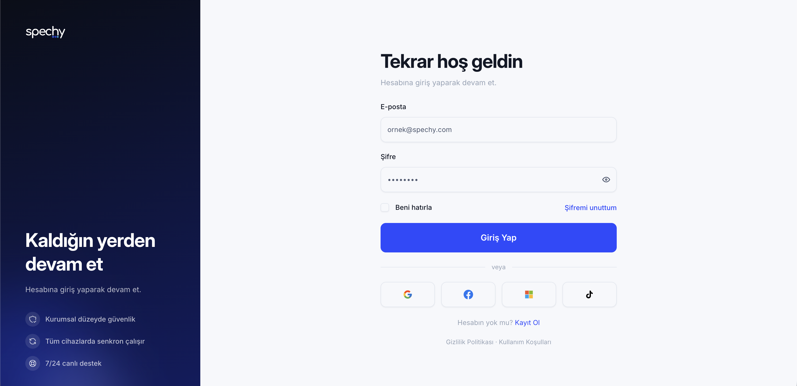

# Spechy UI

Spechy'nin özelleştirdiği [shadcn/ui](https://ui.shadcn.com) bileşenleri —
`new-york` stili, [`@tabler/icons-react`](https://tabler.io/icons) ikonları,
`Inter` tipografisi ve marka renk paletiyle. İki şekilde tüketilebilir:

- **npm paketi `@spechycom/ui`** (önerilen): derlenmiş ESM + tip dosyaları,
  GitHub Packages üzerinden. Sürüm yükseltmeleri `npm update` ile gelir.
- **shadcn registry** (aşağıdaki "shadcn registry" bölümü): bileşen kaynağı
  kendi projenize kopyalanır, dilediğiniz gibi düzenlersiniz — npm sürümüne
  bağımlı kalmazsınız, ama güncellemeler elle taşınır.

Aynı kaynaktan üretilir: registry, `src/` altındaki dosyaları paketler; npm
paketi de aynı dosyaları derler. İkisi arasında kopya fark yoktur.

## Önizleme


## npm paketi

### Kurulum

Paket [GitHub Packages](https://github.com/features/packages)'ta, `@spechycom`
scope'unda yayımlanır. Projenizin köküne (ya da `~/.npmrc`'ye) şunu ekleyin:

```
@spechycom:registry=https://npm.pkg.github.com
```

GitHub Packages'tan `npm install` için okuma izinli bir token (`read:packages`)
gerekir — `.npmrc`'ye `//npm.pkg.github.com/:_authToken=${GITHUB_TOKEN}` satırını
ekleyin ya da `npm login --registry=https://npm.pkg.github.com` ile giriş yapın.

```bash
npm install @spechycom/ui
```

Peer bağımlılıklar: `react`, `react-dom` (^19) ve `radix-ui` (^1.6.7) — bunlar
projenizde zaten kurulu olmalı.

### Tema ve Tailwind

Paket, Tailwind CSS v4 ile çalışır. Ana CSS dosyanızda `@import "tailwindcss"`
satırından **sonra** paketin tema dosyasını import edin, ve paketin ürettiği
sınıfların taranması için bir `@source` ekleyin:

```css
@import "tailwindcss";
@import "@spechycom/ui/theme.css";
@source "../../node_modules/@spechycom/ui/dist";
```

`@source` yolu, bu CSS dosyasının konumuna göre `node_modules`'a giden **göreli**
yoldur — örnekteki `../../` iki klasör yukarıda `node_modules` olduğunu varsayar
(ör. CSS dosyası `web/src/admin/globals.css`'te, `node_modules` `web/node_modules`'ta
ise doğru yol budur); kendi dosya yerleşiminize göre ayarlayın.

Marka tipografisi Inter'dir; tema dosyası yalnızca CSS değişkeni olarak
tanımlar, fontun kendisini yüklemez — ana HTML'inize (ya da CSS'inize) ekleyin:

```html
<link rel="preconnect" href="https://fonts.googleapis.com" />
<link
  href="https://fonts.googleapis.com/css2?family=Inter:ital,opsz,wght@0,14..32,400..800;1,14..32,400..800&display=swap"
  rel="stylesheet"
/>
```

ya da CSS'te:

```css
@import url("https://fonts.googleapis.com/css2?family=Inter:ital,opsz,wght@0,14..32,400..800;1,14..32,400..800&display=swap");
```

Koyu mod, `<html>` üzerindeki `dark` class'ıyla çalışır — paketin `ThemeProvider`/
`useTheme`'i bunu sizin için yönetir (aşağıya bakın).

### Kullanım

```tsx
import { Button, Card, CardContent, ThemeProvider } from "@spechycom/ui";

function App() {
  return (
    <ThemeProvider>
      <Card>
        <CardContent>
          <Button>Kaydet</Button>
        </CardContent>
      </Card>
    </ThemeProvider>
  );
}
```

### v0.1 içeriği

- Tema: `ThemeProvider`, `useTheme` (`light` | `dark` | `system`, `localStorage`'a yazar)
- Temel bileşenler: `Button`, `Input`, `PasswordInput`, `Label`, `Field`, `Card`,
  `Dialog`, `AlertDialog`, `DropdownMenu`, `Select`, `Popover`, `Calendar`,
  `DateRangePicker`, `Tabs`, `Table`, `Badge`, `Tooltip`, `Skeleton`, `Spinner`,
  `Separator`, `ScrollArea`, `Sheet`
- `DataTable`: sunucu taraflı sayfalama (`pageIndex`/`pageCount`/`onPageChange`),
  isteğe bağlı satır linki (`getRowHref`), `loading`/boş durum, `labels` prop'uyla
  İngilizce varsayılanların üzerine yazma.
- `AppSidebar`: daraltma/sabitleme (`localStorage`'a yazılır), profil menüsü
  (tema + dil seçimi + özel işlemler), `renderLink` ile kendi router'ınıza bağlama.

Paket i18n taşımaz — yukarıdaki `labels`/`profileActions`/`languages` gibi
prop'lar üzerinden metin verirsiniz, verilmezse İngilizce varsayılanlar kullanılır.
Giriş ekranları pakete girmez; kendi login/register sayfalarınızı paketteki
bileşenlerle yazarsınız.

Omni-web'deki diğer bileşenler (Alert, Avatar, Checkbox, Combobox, Command,
RadioGroup, Slider, Switch, Textarea, Toggle, vb.) henüz pakette değil — şimdilik
yalnızca [shadcn registry](#shadcn-registry) üzerinden erişilebilirler, sonraki
sürümlerde pakete eklenirler.

## shadcn registry

Registry'yi kullanmak isteyenler için: bileşen kaynağı kendi projenize
kopyalanır, dilediğiniz gibi düzenleyebilirsiniz.

Standart shadcn alias'larına (`@/components/ui`, `@/lib/utils`) uyacak
şekilde yazıldı.

### Otomatik kurulum (herhangi bir coding agent)

Uğraşmak istemiyorsanız [`install.md`](./install.md)'nin tüm içeriğini
kopyalayıp Claude Code, Cursor, Codex vb. bir coding agent'a yapıştırın —
agent `components.json` kurulumundan bileşen eklemeye, Claude Code'daysa
`.claude/skills/spechy-ui/` skill'ini projeye eklemeye kadar hepsini kendisi
yapar. Aşağıdaki bölümler elle yapmak isteyenler içindir.

### Kurulum

`components.json`'a registry'yi **bir kere** tanımlayın — `{name}` yer
tutucusunu CLI her `add` çağrısında istenen bileşenin adıyla otomatik
dolduruyor, component başına tekrar eklemeye gerek yok:

```json
{
  "registries": {
    "@spechy": "https://raw.githubusercontent.com/spechycom/ui/main/public/r/{name}.json"
  }
}
```

Önce tema dosyasını ekleyin (bileşenlerin `rounded-control`, `--control-md`
gibi token'ları buradan gelir), sonra bileşenleri. Paket yöneticinize göre:

```bash
# npm
npx shadcn@latest add @spechy/theme
npx shadcn@latest add @spechy/spechy-ui-all       # tüm bileşenler, tek komut
npx shadcn@latest add @spechy/button @spechy/dialog  # ya da tek tek

# yarn
yarn dlx shadcn@latest add @spechy/theme
yarn dlx shadcn@latest add @spechy/spechy-ui-all
yarn dlx shadcn@latest add @spechy/button @spechy/dialog

# pnpm
pnpm dlx shadcn@latest add @spechy/theme
pnpm dlx shadcn@latest add @spechy/spechy-ui-all
pnpm dlx shadcn@latest add @spechy/button @spechy/dialog

# bun
bunx --bun shadcn@latest add @spechy/theme
bunx --bun shadcn@latest add @spechy/spechy-ui-all
bunx --bun shadcn@latest add @spechy/button @spechy/dialog
```

Tema komutuyla oluşan dosyayı kendi ana CSS dosyanızda
`@import "tailwindcss"`'ten **sonra** import edin:
`@import "./spechy-ui-theme.css";`

## Mevcut bileşenler

alert, alert-dialog, avatar, badge, button, calendar, card, checkbox,
collapsible, combobox, command, date-range-picker, date-time-picker, dialog,
dropdown-menu, field, input, label, option-avatar, otp-input, password-input,
popover, radio-group, scroll-area, select, separator, sheet, skeleton,
slider, spinner, switch, table, tabs, textarea, time-input, toggle,
toggle-group, tooltip

## Hooks

```bash
npx shadcn@latest add @spechy/use-theme
```

`use-theme` bir `ThemeProvider` + `useTheme()` çifti sunar: light/dark/system
seçimini `localStorage`'a yazar, `<html>`'e `dark` class'ını uygular ve
"system" seçiliyken işletim sistemi tema tercihindeki değişiklikleri dinler.
`dashboard` bloğu bunu zaten kurar kurulmaz kullanır (aşağıya bakın); tek
başına da eklenip kendi layout'unuza sarılabilir.

## Bloklar

Bloklar, gerçek sayfa tasarımlarının **sıfır iş mantığına sahip** kopyalarıdır
— form validasyonu, veri çekme, routing, i18n yok; sadece görsel iskelet.
Tek komutla kurulur, dosyalar `src/blocks/<blok-adı>/` altına iner:

```bash
npx shadcn@latest add @spechy/auth        # login, register, forgot/reset/verify sayfaları
npx shadcn@latest add @spechy/dashboard   # app layout: sidebar, header, footer
```

| Blok | İçerik |
| --- | --- |
| `auth` | `auth-layout`, `login-page`, `register-page`, `forgot-password-page`, `reset-password-page`, `verify-code-page`, `social-icons` |
| `dashboard` | `app-layout`, `app-header`, `app-header-tools`, `app-header-search`, `app-header-notifications`, `app-sidebar`, `app-sidebar-nav`, `app-profile-menu`, `app-footer` |



Sayfa içi linkler düz `<a href>` kullanır — kendi router'ınıza bağlamak size
kalır. `dashboard` bloğunda `<AppLayout>` sayfa içeriğini `children` olarak
alır; aktif nav linki, sayfa geçişi gibi routing detayları da size kalır.
Profil menüsündeki tema seçici mock değil, `use-theme` hook'unu kullanır —
dark mode kurulum sonrası gerçekten çalışır durumda gelir. Yeni bir blok
eklemek için `registry/spechy/blocks/<ad>/` altına dosyaları koyup
`node scripts/gen-registry.mjs` çalıştırmak yeterli, script klasörü otomatik
algılar. `DataTable` ve `AppSidebar` artık npm paketinde de var (bkz. yukarısı) —
bunlar için registry'ye ayrıca dosya eklenmez, aynı `src/` kaynağından derlenir.

## Bilinmesi gerekenler

- Bileşenler `@tabler/icons-react` kullanır, `lucide-react` değil.
- Registry hiçbir bileşene sabit bir i18n kütüphanesi/anahtarı zorlamaz.
  Kullanıcıya görünen metin taşıyan yerler (varsayılanı İngilizce) prop
  olarak dışarıdan geçilir, isterseniz kendi çevirinizi verirsiniz:
  - `PasswordInput`: `showLabel`/`hideLabel`
  - `DialogContent`, `SheetContent`: `closeLabel` (sağ üst X butonunun sr-only etiketi)
  - `DialogFooter`: `closeLabel` (`showCloseButton` açıkken buton metni)
  - `DataTable`: `labels` (sayfalama, "Sonuç yok", vb.)
  - `AppSidebar`: `labels` (sabitle/daralt, profil menüsü, tema, dil)

  Örn. `<PasswordInput showLabel={t('password.show')} hideLabel={t('password.hide')} />`.
- `DataTable`'da satırı link yapan `getRowHref`, satırın ilk hücresini gerçek
  bir `<a href>` yapar (Bootstrap'in "stretched link" tekniği) — Cmd/Ctrl/orta
  tık çalışır. Başka bir hücrede tıklanabilir bir eleman (ör. aksiyon butonu)
  varsa, o elemana `className="relative"` ekleyin ki satır linkinin üzerinde
  kalıp tıklanabilir olsun.

## Yeni bileşen ekleme / güncelleme

1. `src/ui/` altına dosyayı ekleyin veya güncelleyin — import'lar
   standart shadcn alias'larıyla yazılmalı (`@/components/ui/x`, `@/lib/utils`).
2. `node scripts/gen-registry.mjs` — `registry.json`'ı importlardan otomatik
   yeniden üretir; script'in uyaramadığı bir bağımlılık varsa uyarı basar,
   elle düzeltin.
3. `npx shadcn@latest build` — `public/r/*.json` statik dosyalarını üretir.
4. Bileşen npm paketine de girecekse `src/index.ts`'e export'unu ekleyin.
5. Commit + push. `main`'e giden her push canlı registry'yi günceller; bir
   `v*` etiketi de npm paketini GitHub Packages'a yayımlar (bkz.
   `.github/workflows/publish.yml`).

## Geliştirme

```bash
npm install
npm run dev              # Storybook, http://localhost:6006
npm test                 # Vitest
npm run typecheck
npm run build            # dist/ (ESM + tipler + theme.css)
npm run build-storybook
```

## Claude Code entegrasyonu

Bu repoda `.claude/skills/spechy-ui/` altında bir kurulum skill'i var. En
kolay yol, [`skills`](https://github.com/vercel-labs/skills) CLI'ıyla hedef
projenize kurmak:

```bash
npx skills add spechycom/ui@spechy-ui
```

Elle kopyalamak isterseniz `.claude/skills/spechy-ui/` klasörünü tüketici
projeye taşıyın. Her iki yolda da kurulumdan sonra o projede `/spechy-ui`
ile bileşen/blok ekletebilirsiniz.
