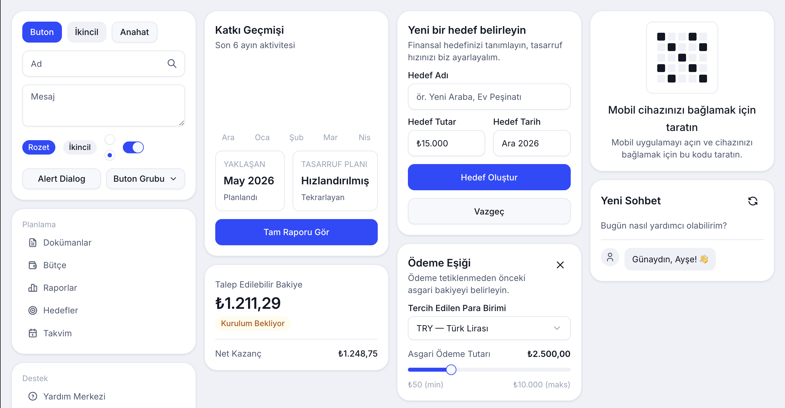

# Spechy UI

Spechy'nin özelleştirdiği [shadcn/ui](https://ui.shadcn.com) bileşenleri —
`new-york` stili, [`@tabler/icons-react`](https://tabler.io/icons) ikonları,
`Inter` tipografisi ve marka renk paletiyle. Klasik bir npm paketi değil, bir
**shadcn registry**: bileşen kaynağı kendi projenize kopyalanır, dilediğiniz
gibi düzenleyebilirsiniz — npm sürümüne bağımlı kalmazsınız.

Standart shadcn alias'larına (`@/components/ui`, `@/lib/utils`) uyacak
şekilde yazıldı.

## Önizleme



## Önkoşullar

Hedef projenizde şunlar kurulu olmalı:

- Tailwind CSS v4
- [`tw-animate-css`](https://www.npmjs.com/package/tw-animate-css)
- Bir shadcn `components.json` (yoksa `npx shadcn@latest init` ile kurun —
  paket yöneticinize göre `yarn dlx`/`pnpm dlx`/`bunx --bun` da kullanılabilir)
- **Vite projelerinde:** `@/*` alias'ı kök `tsconfig.json`'da da tanımlı olmalı
  (`baseUrl` + `paths`) — sadece `tsconfig.app.json`'da olması yetmez, shadcn
  CLI alias'ı kök dosyadan okur. Eksikse kurulum dosyaları `src/` yerine
  literal bir `@/` klasörüne düşer. Bkz.
  [shadcn Vite kurulum dokümanı](https://ui.shadcn.com/docs/installation/vite).

## Otomatik kurulum (herhangi bir coding agent)

Uğraşmak istemiyorsanız [`install.md`](./install.md)'nin tüm içeriğini
kopyalayıp Claude Code, Cursor, Codex vb. bir coding agent'a yapıştırın —
agent `components.json` kurulumundan bileşen eklemeye, Claude Code'daysa
`.claude/skills/spechy-ui/` skill'ini projeye eklemeye kadar hepsini kendisi
yapar. Aşağıdaki bölümler elle yapmak isteyenler içindir.

## Kurulum

`components.json`'a registry'yi **bir kere** tanımlayın — `{name}` yer
tutucusunu CLI her `add` çağrısında istenen bileşenin adıyla otomatik
dolduruyor, component başına tekrar eklemeye gerek yok:

```json
{
  "registries": {
    "@spechy": "https://raw.githubusercontent.com/spechycom/ui/main/public/r/{name}.json"
  }
}
```

Önce tema dosyasını ekleyin (bileşenlerin `rounded-control`, `--control-md`
gibi token'ları buradan gelir), sonra bileşenleri. Paket yöneticinize göre:

```bash
# npm
npx shadcn@latest add @spechy/theme
npx shadcn@latest add @spechy/spechy-ui-all       # tüm bileşenler, tek komut
npx shadcn@latest add @spechy/button @spechy/dialog  # ya da tek tek

# yarn
yarn dlx shadcn@latest add @spechy/theme
yarn dlx shadcn@latest add @spechy/spechy-ui-all
yarn dlx shadcn@latest add @spechy/button @spechy/dialog

# pnpm
pnpm dlx shadcn@latest add @spechy/theme
pnpm dlx shadcn@latest add @spechy/spechy-ui-all
pnpm dlx shadcn@latest add @spechy/button @spechy/dialog

# bun
bunx --bun shadcn@latest add @spechy/theme
bunx --bun shadcn@latest add @spechy/spechy-ui-all
bunx --bun shadcn@latest add @spechy/button @spechy/dialog
```

Tema komutuyla oluşan dosyayı kendi ana CSS dosyanızda
`@import "tailwindcss"`'ten **sonra** import edin:
`@import "./spechy-ui-theme.css";`

## Mevcut bileşenler

alert, alert-dialog, avatar, badge, button, calendar, card, checkbox,
collapsible, combobox, command, date-range-picker, date-time-picker, dialog,
dropdown-menu, field, input, label, option-avatar, otp-input, password-input,
popover, radio-group, scroll-area, select, separator, sheet, skeleton,
slider, spinner, switch, table, tabs, textarea, toggle, toggle-group, tooltip

## Bloklar

Bloklar, gerçek sayfa tasarımlarının **sıfır iş mantığına sahip** kopyalarıdır
— form validasyonu, veri çekme, routing, i18n yok; sadece görsel iskelet.
Tek komutla kurulur, dosyalar `src/blocks/<blok-adı>/` altına iner:

```bash
npx shadcn@latest add @spechy/auth        # login, register, forgot/reset/verify sayfaları
npx shadcn@latest add @spechy/dashboard   # sidebar + header + footer + layout shell
```

| Blok | İçerik |
| --- | --- |
| `auth` | `auth-layout`, `login-page`, `register-page`, `forgot-password-page`, `reset-password-page`, `verify-code-page`, `social-icons` |
| `dashboard` | `app-layout`, `app-header`, `app-sidebar`, `app-footer` |

Sayfa içi linkler düz `<a href>`, dashboard shell `Outlet` yerine `children`
prop'u kullanır — kendi router'ınıza bağlamak size kalır. Yeni bir blok
eklemek için `registry/spechy/blocks/<ad>/` altına dosyaları koyup
`node scripts/gen-registry.mjs` çalıştırmak yeterli, script klasörü otomatik
algılar.

## Bilinmesi gerekenler

- Bileşenler `@tabler/icons-react` kullanır, `lucide-react` değil.
- Registry hiçbir bileşene sabit bir i18n kütüphanesi/anahtarı zorlamaz.
  Kullanıcıya görünen metin taşıyan yerler (varsayılanı İngilizce) prop
  olarak dışarıdan geçilir, isterseniz kendi çevirinizi verirsiniz:
  - `PasswordInput`: `showLabel`/`hideLabel`
  - `DialogContent`, `SheetContent`: `closeLabel` (sağ üst X butonunun sr-only etiketi)
  - `DialogFooter`: `closeLabel` (`showCloseButton` açıkken buton metni)

  Örn. `<PasswordInput showLabel={t('password.show')} hideLabel={t('password.hide')} />`.

## Yeni bileşen ekleme / güncelleme

1. `registry/spechy/ui/` altına dosyayı ekleyin veya güncelleyin — import'lar
   standart shadcn alias'larıyla yazılmalı (`@/components/ui/x`, `@/lib/utils`).
2. `node scripts/gen-registry.mjs` — `registry.json`'ı importlardan otomatik
   yeniden üretir; script'in uyaramadığı bir bağımlılık varsa uyarı basar,
   elle düzeltin.
3. `npx shadcn@latest build` — `public/r/*.json` statik dosyalarını üretir.
4. Commit + push. `main`'e giden her push canlı registry'yi günceller.

## Claude Code entegrasyonu

Bu repoda `.claude/skills/spechy-ui/` altında bir kurulum skill'i var. En
kolay yol, [`skills`](https://github.com/vercel-labs/skills) CLI'ıyla hedef
projenize kurmak:

```bash
npx skills add spechycom/ui@spechy-ui
```

Elle kopyalamak isterseniz `.claude/skills/spechy-ui/` klasörünü tüketici
projeye taşıyın. Her iki yolda da kurulumdan sonra o projede `/spechy-ui`
ile bileşen/blok ekletebilirsiniz.
